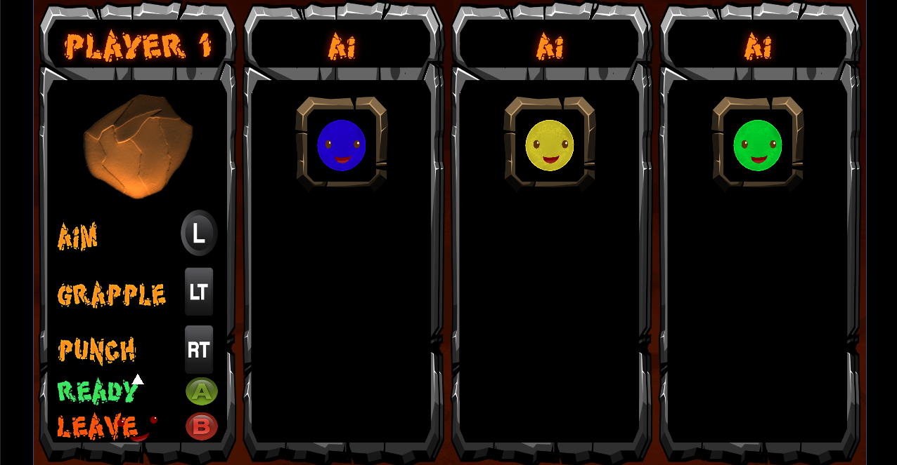

## [Capstone Game Project](https://github.com/HungryAdi/Coursework/tree/master/CapstoneGameProject)

[Gameplay Footage](https://drive.google.com/file/d/1tcMzN_4WZH0PHwv9iWX5jG0w-wIaTd-Q/view?usp=sharing)

### Title Screen

'Blobcano' is my Senior Game Project developed with a team of 6 in Unity. It is a Multiplayer Arcade game with full Xbox 360 Controller support and original art and sound assets. Over the course of two quarters (One quarter completed) my team will create a feature complete game under the guidance of mentors in the industry (Blizzard and Amazon Game Studios).

## Playing the Game
* Make sure an Xbox 360 controller is connected!
* Run the executable for your platform (GameBuild_[Operating System])
* Controls are available in the Player Select Screen

### Player Select Screen with 1 player and 3 AI opponents selected. Controls are displayed on the screen.

* Grapple onto falling rocks to outlast your opponents!

### In game battle to survive!

